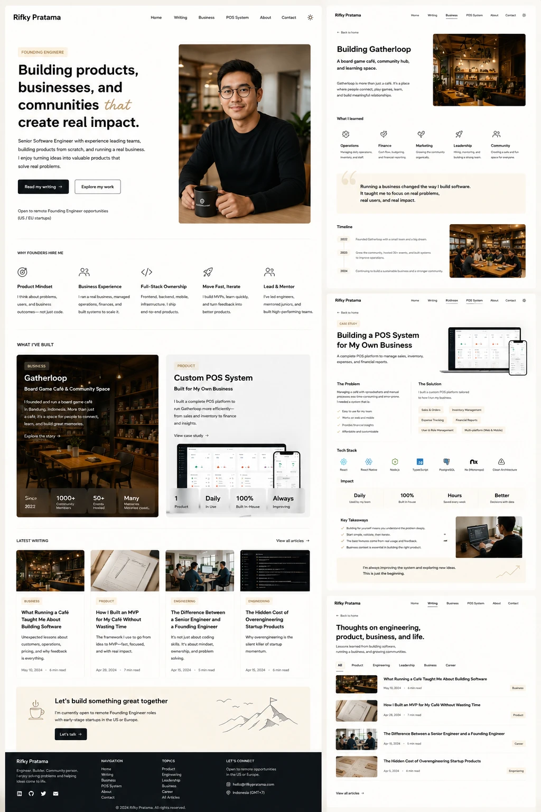

# Personal Website Redesign — PRD

> **Superseded:** the home page (`/`) direction described here has been replaced by [`LANDING_PAGE_REDESIGN_PRD.md`](./LANDING_PAGE_REDESIGN_PRD.md), which redesigns it into a minimal, Linktree-inspired single-column profile. This document is kept for historical reference only; the case-study pages (`/business`, `/pos-system`) and other sections it describes are otherwise unaffected.

> Repositioning M. Nindra Zaka's personal site from a generic "senior engineer portfolio" into a brand statement: **a software engineer who understands business impact** — someone who builds products, runs a real business, and ships outcomes, not just code.

---

## 0. Reference mockup

The visual target for every phase below is the mockup at:



It shows, top-to-bottom and left-to-right:

- **Home page** (full column on the left) — navbar, hero with portrait, "Why founders hire me" 5-up, "What I've Built" 2 cards, "Latest Writing" 4-up, CTA banner, footer.
- **Business / Gatherloop page** (top right) — hero with café photo, "What I learned" 5-up icon stats, pull quote, timeline.
- **POS System case study page** (middle right) — hero with product mockup, Problem/Solution two-column, Tech Stack icon row, 4 impact stats, Key Takeaways checklist.
- **Writing index page** (bottom right) — hero, category filter tabs, stacked post list.

When a phase below says "matches mockup," this is the file to compare against. The name shown on the mockup is "Rifky Pratama" but we use **M. Nindra Zaka** everywhere — the mockup is layout/style reference only.

---

## 1. Background & Goals

### 1.1 Current state

The site is a single-page Next.js + Tamagui portfolio built on top of `tamakit` primitives (`Hero`, `Features`, `Portfolio`, `Blog`, `TestimonialCentered`). It markets the owner as a generic senior frontend/full-stack engineer with a list of skills, testimonials, two portfolio items (Gatherloop POS, Tamakit), and a blog feed.

Pain points:

- The narrative is feature-list, not outcome-driven. Visitors learn what tech the owner knows, not what they have *delivered*.
- The home page tries to say everything at once; there is no dedicated surface for the business (Gatherloop) or for the flagship product (POS System) as case studies.
- The brand voice is interchangeable with thousands of other engineer portfolios.
- Color/theme switcher (8 accent colors + light/dark toggle inline on the hero) competes with the content for attention.
- Writing is tucked into a section on the home page; there is no proper index, no categorization, no way to browse by topic.

### 1.2 Goals

1. **Reposition the brand.** Lead with the line *"Building products, businesses, and communities that create real impact."* Show, on the home page, that the owner is a Founding Engineer who has run a real café/business (Gatherloop), built a real product to support it (POS System), and writes about both engineering and business.
2. **Give each pillar its own page.** Home, Writing index, Business (Gatherloop), POS System (case study), About, Contact.
3. **Tighten the visual system.** Warm, editorial, light-mode-first aesthetic (cream/beige background, serif display headings, sans body, soft category chips). Keep light/dark toggle but move it out of the hero into the navbar.
4. **Make writing browsable.** Dedicated `/writing` index with category filters, thumbnails, and clear hierarchy.
5. **Fully responsive.** Mobile-first behavior on every new surface: stacked hero, collapsible nav, single-column stats, swipe-free reading.

### 1.3 Non-goals

- Rewriting blog post content. We keep all 10 existing posts under `src/contents/` as-is.
- Replacing the markdown blog detail renderer. The `/blog/[slug]` page keeps working.
- Migrating off Tamagui / React Native Web. We continue using it, but we lean less on `tamakit` and more on hand-built sections where the design is opinionated.
- A CMS. Content stays as markdown + frontmatter.

### 1.4 Success criteria

- A first-time visitor can, within 10 seconds on the home page, name three things: (a) the owner is an engineer-founder, (b) the owner runs Gatherloop, (c) the owner ships products end-to-end.
- All new pages render correctly at 360 px, 768 px, 1024 px, and 1440 px.
- Lighthouse Performance ≥ 90 on the home page (mobile, throttled).
- No regression in the existing `/blog/[slug]` reading experience.

---

## 2. Information architecture

```
/                  Home — hero, why-hire, what-i've-built, latest writing, CTA, footer
/writing           Writing index — hero, category filter, all posts
/blog/[slug]       Existing post detail (unchanged content, restyled chrome)
/business          Gatherloop case study — hero, what-i-learned, quote, timeline
/pos-system        POS System case study — hero, problem/solution, tech, stats, takeaways
/about             Short bio, headshot, social, current focus
/contact           Email + social, optional inline form (mailto:)
```

Top-nav order: **Home · Writing · Business · POS System · About · Contact** + theme toggle.

Footer columns: **Brand & tagline · Navigation · Topics · Let's Connect**, with social icons (GitHub, LinkedIn, Twitter, Email) and a copyright row.

---

## 3. Design system

### 3.1 Visual tone

- **Background:** warm off-white `#FAF7F2` (light) / deep neutral `#15110E` (dark).
- **Surface cards:** cream `#F4EFE6` with subtle border.
- **Text:** near-black `#1A1613` (light) / cream (dark).
- **Accent (single):** muted gold/ochre `#B8893A` for italicized phrase, badges, primary CTA.
- **Category chips:** soft pill backgrounds keyed by category (Product = warm cream, Engineering = sage, Leadership = lavender, Business = ochre, Career = clay).
- **Removed:** the 8-color accent picker. One accent only, set by theme.

### 3.2 Typography

- **Display / headings:** a serif (e.g. `Fraunces` or `Instrument Serif`). Tight tracking. Mixed-style headline supported (regular + italic for the accent phrase).
- **Body:** existing sans (Tamagui default Inter-like stack).
- **Scale:** display 56/40/32, h2 28/24, body 16, caption 13.

### 3.3 Tokens

Add a `theme.ts` (or extend `tamagui.config.ts`) with named tokens used everywhere: `bg`, `surface`, `border`, `text`, `textMuted`, `accent`, `chipProduct`, `chipEngineering`, etc. New code references tokens, never raw hex.

### 3.4 Components (new, reusable)

- `Section` — vertical-rhythm wrapper, max-width container.
- `SectionHeader` — kicker + h2 + optional sub.
- `Chip` — categorized pill (variant by category).
- `IconStat` — icon + label + description (used by "Why founders hire me", "What I learned").
- `ProjectCard` — large card with category, title, subtitle, body, inline stats, CTA.
- `PostCard` — thumbnail + chip + title + dek + meta.
- `Timeline` — year markers + body, with image slot.
- `Checklist` — checkmark + line item.
- `CTABanner` — centered hero-CTA with decorative SVG.

The current `tamakit` `Hero` / `Features` / `Portfolio` / `Blog` / `Footer` / `Navbar` will be retired from new surfaces. We do not delete them in one PR; we replace per-section.

### 3.5 Light/dark mode

Keep the existing `next-theme` + Tamagui theme switching. The toggle moves to a single icon button in the navbar (sun/moon). The 8-color `AccentButton` row and `AccentContext` are removed.

---

## 4. Page specs

### 4.1 Home (`/`)

Order, top to bottom:

1. **Navbar** — left: name "M. Nindra Zaka". Right: nav links + theme toggle. Mobile: hamburger.
2. **Hero** — two columns desktop, stacked mobile.
   - Left: kicker chip `FOUNDING ENGINEER`, H1 "Building products, businesses, and communities *that* create real impact." (italic accent on "that"), body paragraph, two CTAs ("Read my writing" → `/writing`, "Explore my work" → `#what-ive-built`), small grey note "Open to remote Founding Engineer opportunities (US / EU startups)".
   - Right: portrait image (use existing `/images/profile.jpg` or new `/images/hero.png`).
3. **Why founders hire me** — section title + 5 `IconStat` columns: Product Mindset, Business Experience, Full-Stack Ownership, Move Fast & Iterate, Lead & Mentor. Wraps to 2-col then 1-col on smaller screens.
4. **What I've Built** — section kicker `WHAT I'VE BUILT`, two large `ProjectCard`s side by side (Gatherloop / Business, Custom POS System / Product), with inline stat rows ("Since 2022 / 1000+ Members / 50+ Events / Many Memories" and "1 Product / Daily In Use / 100% Built In-House / Always Improving"). Cards link to `/business` and `/pos-system`.
5. **Latest Writing** — section kicker `LATEST WRITING` + `View all articles →` link to `/writing`. Grid of the 4 most recent `PostCard`s.
6. **CTA Banner** — `Let's build something great together`, body line about openness to founding engineer roles, single CTA `Let's talk →` (mailto). Decorative cup-of-coffee + mountains SVG on the sides.
7. **Footer** — 4 columns (Brand, Navigation, Topics, Let's Connect) + social icons + copyright.

### 4.2 Writing index (`/writing`)

1. Navbar + Back link to home.
2. Hero strip: "Thoughts on engineering, product, business, and life" + sub.
3. Category filter tabs: `All · Product · Engineering · Leadership · Business · Career`. Active tab underlined. Client-side filter.
4. Stacked list of all posts (thumbnail left, title + dek + meta right, category chip on far right). Hover → link to `/blog/[slug]`.
5. `View all articles →` link at the bottom (anchors to top for now; placeholder for pagination).
6. Footer.

**Categories source:** we add an optional `category` field to each post's frontmatter. Posts without one default to `Engineering` (current 10 posts are all engineering tutorials, so this is a safe default and requires no content rewrite).

### 4.3 Blog detail (`/blog/[slug]`)

Keep `BlogDetailScreen` and `MarkdownView`. Update the surrounding chrome (navbar + footer) to the new system. Add a `← Back to writing` link above the title.

### 4.4 Business — Gatherloop (`/business`)

1. Back link.
2. Hero: chip `BUSINESS` / kicker, H1 "Building Gatherloop", subtitle, body, photo of the café on the right.
3. **What I learned** — section header + 5 `IconStat`s: Operations, Finance, Marketing, Leadership, Community.
4. Pull quote on a soft cream surface: *"Running a business changed the way I build software…"*.
5. **Timeline** — 2022 / 2023 / 2024 rows with year + body, accompanied by an image of the café.
6. Footer.

### 4.5 POS System (`/pos-system`)

1. Back link.
2. Hero: chip `CASE STUDY`, H1 "Building a POS System for My Own Business", body, product mockup image (desktop + mobile).
3. **The Problem / The Solution** — two-column layout. Solution column has 4 feature chips (Sales & Orders, Inventory Management, Expense Tracking, Financial Reports, User & Role Management, Multi-platform).
4. **Tech Stack** — row of 6 icon tiles: React, React Native, Node.js, TypeScript, PostgreSQL, Nx (Monorepo), Clean Architecture.
5. **Impact** — 4 stat tiles (Daily / Used by my team, 100% / Built In-House, Hours / Saved every week, Better / Decisions with data).
6. **Key Takeaways** — `Checklist` of 5 bullets, with a small accompanying photo of the owner working.
7. Closing italic line: *"I'm constantly improving the system and exploring new ideas. This is just the beginning."*
8. Footer.

### 4.6 About (`/about`)

Short: headshot, 3-paragraph bio (engineer + founder + mentor), current focus block ("Open to remote Founding Engineer roles"), social row. Reuses hero-style two-column layout.

### 4.7 Contact (`/contact`)

Minimal: a single block with email (mailto), GitHub, LinkedIn, location ("Indonesia / GMT+7"). No backend form.

---

## 5. Responsive rules

| Breakpoint  | Width    | Hero               | "Why hire me"  | "What I've built" | Latest writing | Stats rows   |
|-------------|----------|--------------------|----------------|-------------------|----------------|--------------|
| Mobile      | < 640    | Stacked, image top | 1 col          | 1 col             | 1 col          | 2 col grid   |
| Tablet      | 640–1024 | 2 col              | 2–3 col        | 1 col             | 2 col          | 4 col        |
| Desktop     | ≥ 1024   | 2 col              | 5 col          | 2 col             | 4 col          | 4 col        |

Navbar collapses into a hamburger sheet on `< 768`. Footer collapses to a single column with accordion-free stacking on `< 640`.

---

## 6. Out-of-scope (post-launch)

- Analytics / event tracking.
- RSS feed / sitemap regeneration (already partially in place).
- Newsletter signup.
- Search.
- Internationalization.

---

## 7. Implementation plan — phased PRs

Each phase is intended to ship as a **single, small, reviewable PR**. Phases are ordered so the site is always shippable at the end of every phase (no broken pages mid-way). PR sizes are estimates of changed/added files.

### Phase 0 — Design tokens & shared chrome  *(foundation; ~6 files)*

- Add `src/theme/tokens.ts` exporting color, spacing, radius, font tokens for light + dark.
- Extend `tamagui.config.ts` to register the new tokens and themes (`light`, `dark`) with the new palette.
- Add `src/components/Section.tsx`, `SectionHeader.tsx`, `Chip.tsx`.
- Add `<Navbar />` and `<Footer />` as **new** in-repo components under `src/components/site/` (not yet swapped into pages).
- Add Google Font / `next/font` for the chosen serif display face.
- **No page changes.** Existing site still renders via `tamakit`.

**Reviewable in:** ~15 min. Pure additive.

---

### Phase 1 — Home: new navbar + hero + footer  *(~5 files)*

- Replace the `tamakit` `Navbar`, `Hero`, and `Footer` on `/` with the new in-repo components.
- Delete the `ColorModeSwitcher` + `AccentButton` row from the hero. Move the dark/light toggle into the new navbar.
- Add the "Founding Engineer" chip, the italicized "that" headline, two CTAs, and the openness note.
- Keep `Features`, `TestimonialCentered`, `Portfolio`, `Blog` sections **as-is for now** (they will be replaced in later phases).
- Verify all nav links to `/writing`, `/business`, `/pos-system`, `/about`, `/contact` route to placeholder 404s gracefully (or temporarily anchor-scroll). The pages land in their own phases.

**Acceptance:** Home hero matches mockup at desktop + mobile. Theme toggle works. Old sections still render below.

---

### Phase 2 — Home: "Why founders hire me" section  *(~3 files)*

- Add `IconStat` component.
- Replace the existing `Features` ("My Skills") section with the 5-pillar "Why founders hire me" grid.
- Remove the testimonial section from the home page (testimonials can land on `/about` later, not required for v1).

**Acceptance:** 5 icon stats render desktop (5-col) → tablet (3-col) → mobile (1-col).

---

### Phase 3 — Home: "What I've Built" section  *(~3 files)*

- Add `ProjectCard` component.
- Replace the `tamakit` `Portfolio` block with two `ProjectCard`s linking to `/business` and `/pos-system`.
- Inline stats row inside each card.

**Acceptance:** Two cards render side-by-side on desktop, stack on mobile. Links route to `/business` and `/pos-system` (404 fine for now).

---

### Phase 4 — Home: "Latest Writing" + CTA banner  *(~4 files)*

- Add `PostCard` component.
- Replace the `tamakit` `Blog` block with a 4-column `PostCard` grid showing the 4 most recent posts.
- Add `CTABanner` component with the "Let's build something great together" copy and decorative SVG cup + mountains.
- Add `View all articles →` link to `/writing` (still 404 until Phase 5).

**Acceptance:** 4-col grid → 2-col → 1-col. CTA renders. Home now matches mockup top-to-bottom (with `/writing`, `/business`, `/pos-system` still 404).

---

### Phase 5 — Writing index page (`/writing`)  *(~5 files)*

- New `src/screens/WritingScreen/` with hero + filter tabs + post list.
- New `src/pages/writing.tsx` reusing the `getStaticProps` logic from `src/pages/index.tsx`, returning all posts.
- Add optional `category` field to frontmatter spec; default to `Engineering` when missing. No content rewrite required.
- Client-side category filter (`useState` over `All | Product | Engineering | Leadership | Business | Career`).
- Reuse `Navbar`, `Footer`, `PostCard`, `Chip`.

**Acceptance:** All 10 existing posts list under "All" and "Engineering". Filter switching is instant. Mobile: chips wrap, list stacks vertically.

---

### Phase 6 — Blog detail chrome refresh  *(~2 files)*

- Wrap `BlogDetailScreen` with the new `Navbar` + `Footer`.
- Add `← Back to writing` link above the title.
- Restyle the title/meta block to the new typography.
- **Do not** touch `MarkdownView` rendering.

**Acceptance:** Reading any of the 10 posts feels consistent with the rest of the site.

---

### Phase 7 — Business / Gatherloop page (`/business`)  *(~5 files)*

- New `src/screens/BusinessScreen/`, new `src/pages/business.tsx`.
- Sections: hero with café image, "What I learned" (5 `IconStat`s), pull quote, `Timeline` (2022/2023/2024), footer.
- Add `Timeline` component.
- Source new images under `public/images/business/` (placeholders OK; replace with real photos later).

**Acceptance:** Page renders mockup fidelity at desktop + mobile. Linked from home "What I've Built" card.

---

### Phase 8 — POS System case study (`/pos-system`)  *(~6 files)*

- New `src/screens/PosSystemScreen/`, new `src/pages/pos-system.tsx`.
- Sections: hero with product mockup, two-column Problem/Solution, Tech Stack icon row, 4-tile impact stats, `Checklist` of takeaways, closing italic line, footer.
- Add `Checklist` component.
- Reuse `Chip`, `IconStat`, `Section`, `SectionHeader`.

**Acceptance:** Full case study renders. Tech stack icons wrap on mobile. Stats grid 4 → 2 → 2.

---

### Phase 9 — About + Contact pages  *(~4 files)*

- New `src/screens/AboutScreen/` and `src/pages/about.tsx`: two-column intro (headshot + bio), "current focus" block, social row.
- New `src/screens/ContactScreen/` and `src/pages/contact.tsx`: single panel with email/GitHub/LinkedIn/location.
- Both reuse the standard navbar + footer.

**Acceptance:** All nav links now resolve to real pages.

---

### Phase 10 — Cleanup, SEO, polish  *(~5 files)*

- Delete `AccentContext`, `AccentButton`, `ColorModeSwitcher` (no longer referenced after Phase 1) and remove from `src/components/index.tsx`.
- Remove `tamakit` imports that are no longer referenced; drop the dependency from `package.json` if fully unused.
- Per-page `<Head>` (`title`, `description`, OG image) via `next/head`.
- Add `public/og/*` social images for home, writing, business, pos-system.
- Lighthouse pass: image dimensions, `next/image` migration where missing, font preloading.
- Quick a11y pass: nav landmarks, alt text, focus rings on CTAs and chips.

**Acceptance:** Lighthouse mobile ≥ 90 perf / ≥ 95 a11y on home. No unused code.

---

## 8. Tracking & risks

| Risk                                                      | Mitigation                                                                                           |
|-----------------------------------------------------------|------------------------------------------------------------------------------------------------------|
| `tamakit` tightly coupled with `Layout` ssr-dynamic loads | Replace per-section, not all at once. Phases 1–4 leave older sections intact while new ones land.    |
| Mockup name "Rifky Pratama" ≠ actual brand                | Use **M. Nindra Zaka** everywhere. Mockup is layout reference only.                                  |
| No real photos yet for `/business` and `/pos-system`      | Ship Phase 7/8 with placeholder images under `public/images/business/` and `public/images/pos/`.     |
| Adding `category` frontmatter to old posts                | Make field optional with `Engineering` default. Zero-touch for existing content.                     |
| Light/dark contrast on warm cream palette                 | Verify each token pair hits WCAG AA in Phase 0 before any page lands.                                |

---

## 9. Decisions deferred

- Final serif font choice (Fraunces vs Instrument Serif vs Newsreader). Lock in Phase 0.
- Whether to keep testimonials anywhere (currently planned to drop). Revisit on `/about` in Phase 9.
- Pagination on `/writing` once post count > 20. Out of scope for now.
- Whether `/business` and `/pos-system` should be `/work/business` and `/work/pos-system` under a `/work` index. Current plan: keep flat for simpler nav.
